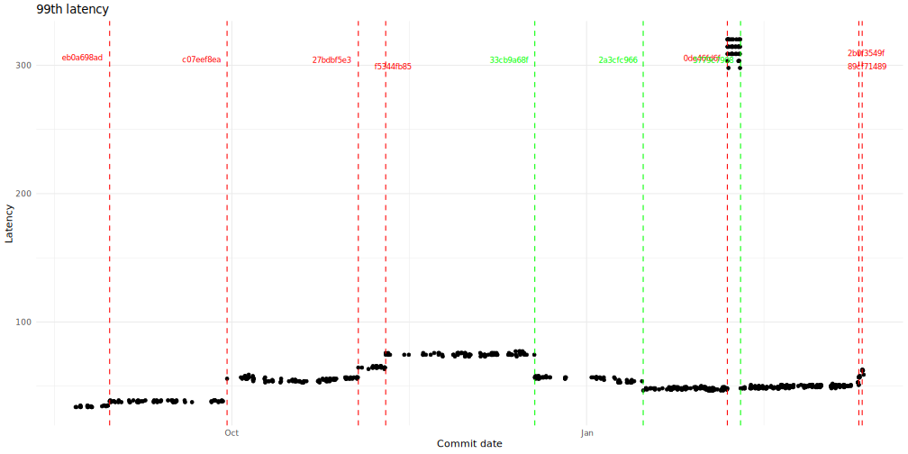

# Unofficial neon/pageserver versions benchmark

Goal: To find performance change points (commits) in the [Neon pageserver](https://github.com/neondatabase/neon). Absolute benchmark values are irrelevant.

Starting commit: [b95addddd](https://github.com/neondatabase/neon/commit/b95addddd54dc1b25850b0784206941ebaea6af4). An older pageserver cannot load the current format of the tenant.

## Read only test

Latency:

Transactions per second:

Notes:

- Changepoint at 221531c9d (2024-02-01) is technical, because of changes in test data.

To copy commit hash open raw SVG or look up the [source data](./results.md).

## Setup

System:

- Processor: Intel Ice Lake (36 CPU cores).
- Memory: 72GB RAM.
- Storage: Local SSD.
- Operating System: Linux Ubuntu 22.04.3 LTS with a 5.15 kernel.
- Benchmarking Tool: [Sysbench](https://github.com/akopytov/sysbench) `1.1.0-2ca9e3f`.

Neon:

- Pageserver: default settings are used.
- Compute: PostgreSQL 15, with reduced `shared_buffers` to 256 (2 MB).
- Both Compute and Pageserver are running on the same host.

Database:

- Single tenant with 521GB logical size.
- 100 tables, each containing around 20M rows, generated via [prepare.sh](./prepare.sh) script.
- LSM state: 563 image layers and 42 deltas (9 L0 and 33 L1).
- Both image layers and delta layers have a size of 1 GB each.

Refer to [run.sh](./run.sh) script for workload parameters. System has free CPU cores, RAM, IOPS, when test is running.
