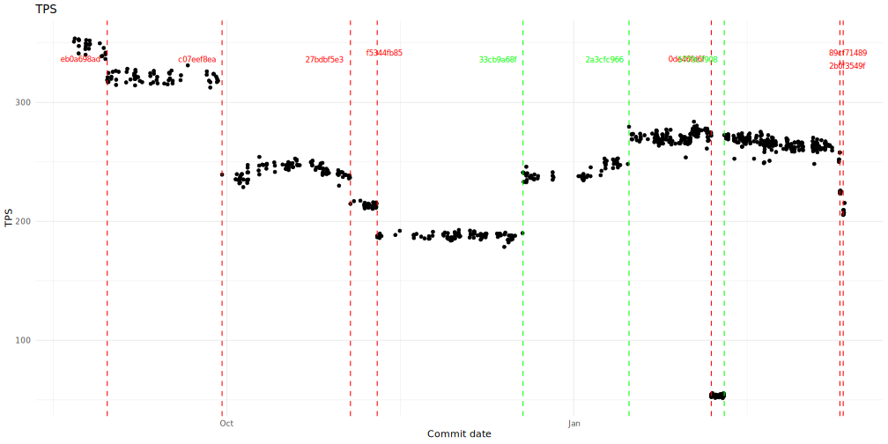

# Unofficial neon/pageserver versions benchmark

Goal: To find performance change points (commits) in the [Neon pageserver](https://github.com/neondatabase/neon). Absolute benchmark values are immaterial.

Starting commit: https://github.com/neondatabase/neon/commit/b95addddd54dc1b25850b0784206941ebaea6af4. An older pageserver cannot load the current format of the tenant.

## Current Results

Latency:

Transactions per second:

[Source data](./results.html).
